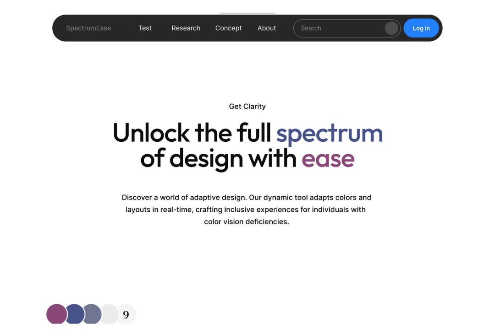
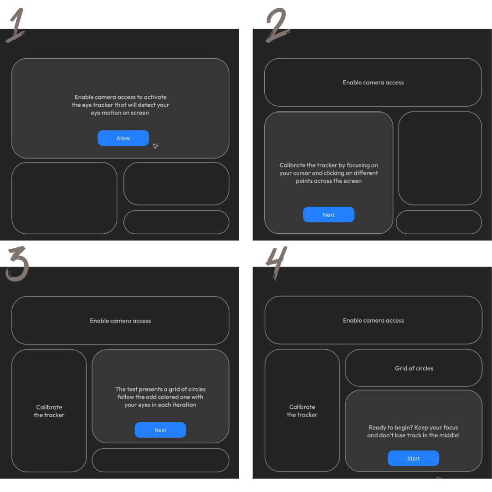
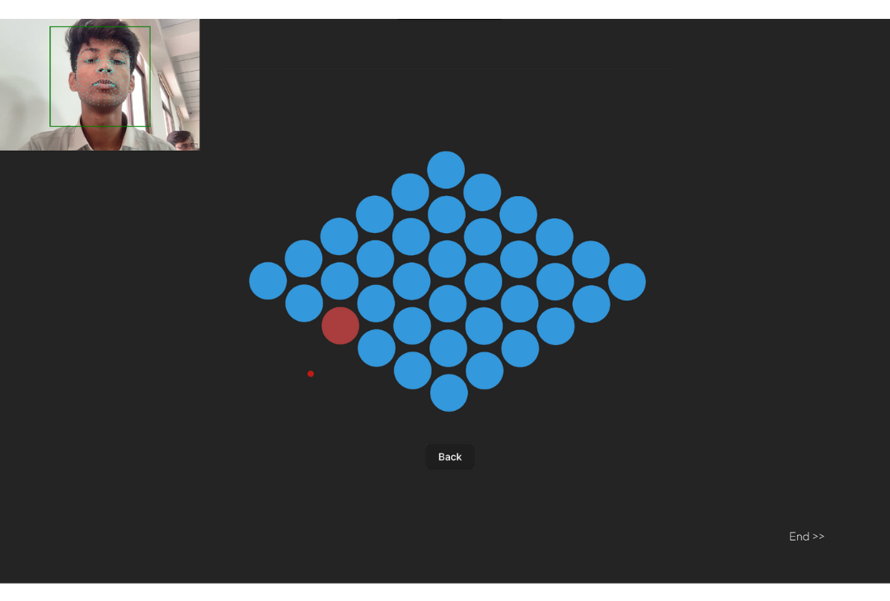
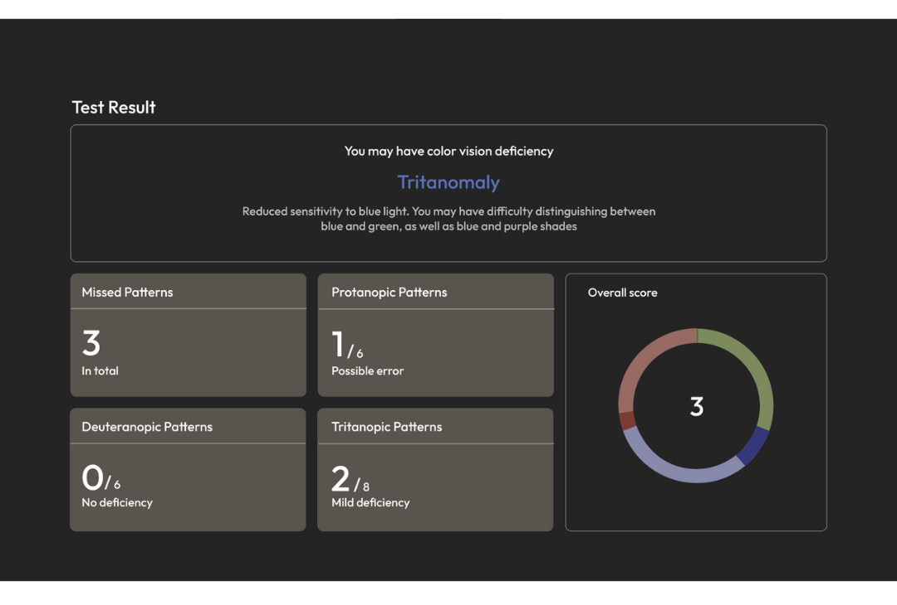
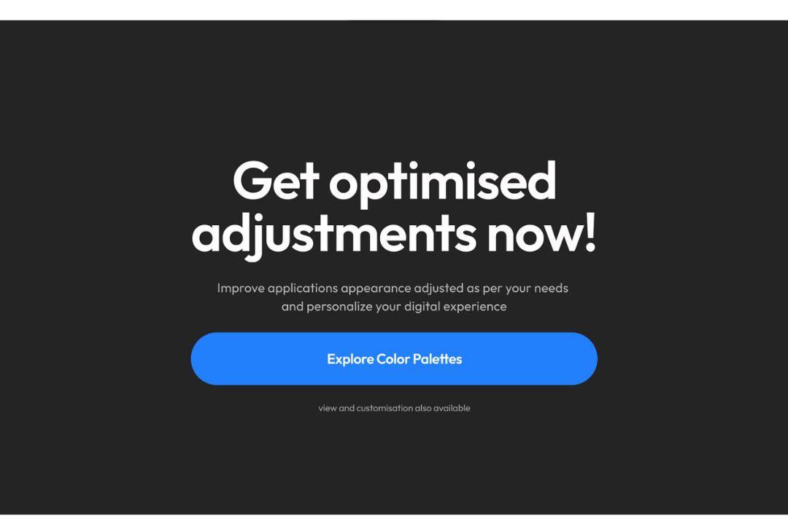

# SpectrumEase

Designed to empower individuals with color vision deficiencies, A transformative color accessibility tool that evaluates the level and type of color blindness of users and dynamically modifies digital layouts ensuring readability, clarity, and usability across various digital platforms and applications.


&nbsp;
&nbsp;
&nbsp;
&nbsp;

## Table of contents
- [General info](#general-info)
- [Design](#design)
- [Technologies](#technologies)
- [Setup](#setup)

## General info
Leveraging eye-tracking technology with advanced analysis algorithms, and user-friendly testing interface & browser extensions, the experimental solution seeks to enhance the accessibility, usability, and inclusivity of digital experiences for individuals with color vision deficiencies. We can deliberately classify the approach into three steps:
<br>

1: Color Vision Deficiency Assessment with Eye-Tracking<br>

2: Generation of Optimized Color Palettes<br>

3: Screen Layout Enhancement via Browser Extension

## Design






## Technologies
- OpenCV.js/Webgazer.js for iris tracker
- React + vite for robust & efficient user interactions
- Node.js + Express.js for data processing and API handling.
- Chart.js/Recharts for result visualisation

## Setup
After cloning repository
- Set Up the Client
```
$ cd Client
$ npm install
$ npm run dev
```
- Set Up the Server
```
$ cd ../Server
$ npm install
$ npm start

```
Set up environment variables in .env for MongoDB and other configurations.
(MONGODB_URI=mongodb://localhost:27017/your-database-name
PORT=5000)


## Contributing

Contributions are always welcome!


